# **Machine Learning Model Deployment in the Cloud**
## **Deployment of ML models on the cloud using AWS Sagemaker**

**Author: Marie Stephen Leo**

### About the Course
This course aims to equip a learner with practical knowledge of Deploying ML models on the cloud using AWS Sagemaker.

### Target Audience
The target audience for this course would include professionals aspiring to become Data Scientists, Machine Learning Engineers, Data Analysts, Statisticians, Data Architects, Data engineers, etc. 

## Setup
1. Sign up for a free AWS account at https://aws.amazon.com
1. In your AWS console search for “sagemaker” and click it

    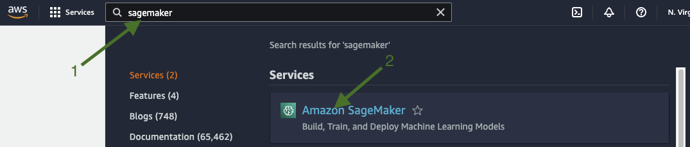

1. Click on Studio

    

1. Click on Launch SageMaker Studio

    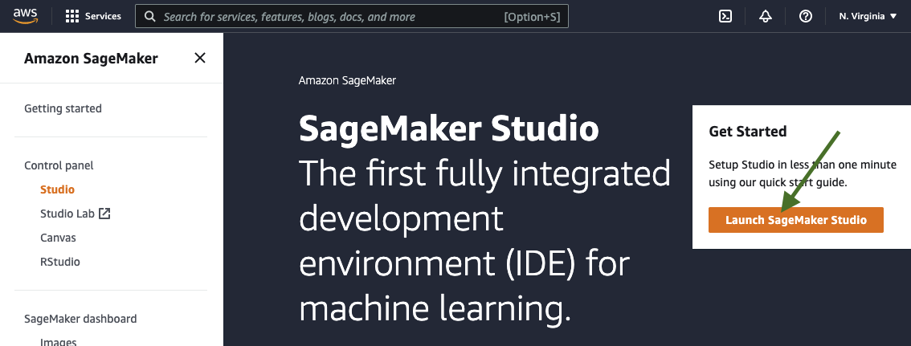

1. The first time you launch Sagemaker Studio, you’ll have to do a one time setup. 
    - Select Quick setup 
    - Type a name that’s meaningful
    - Select create a new role from the dropdown

    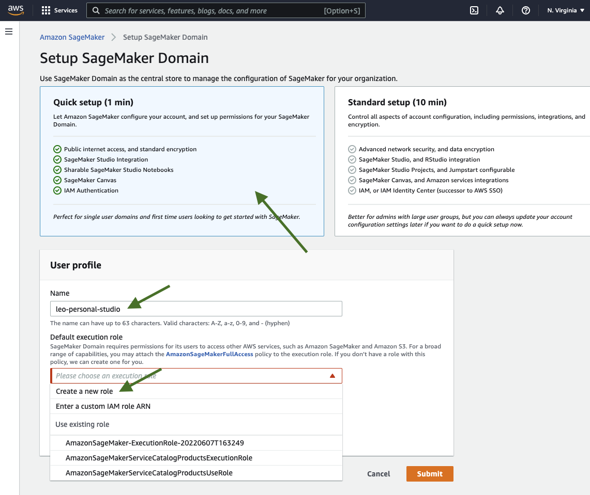

1. Select “Any S3 bucket” so that your Studio notebooks have access to any data on any S3 bucket in your account. Click Create role

    

1. Once the role is created, click Submit

    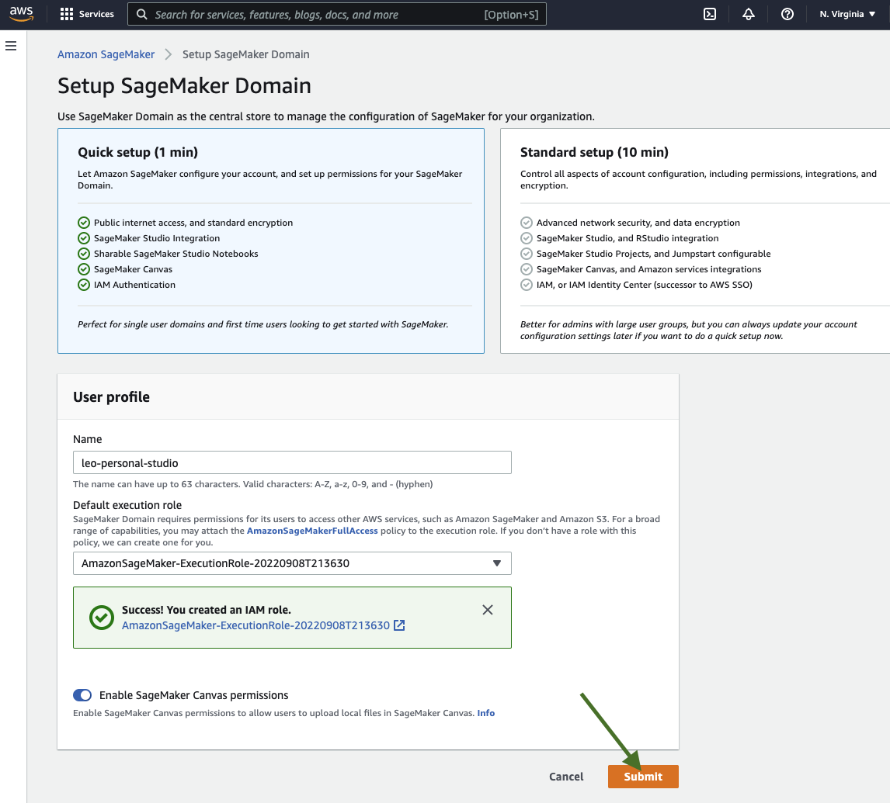

1. The setup will take some time. You can see the status on the top of the page

    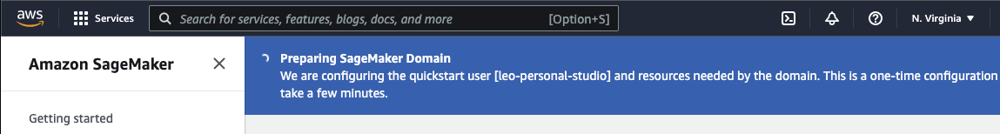

1. Once the setup is done, you’ll see the domain you created with a “Launch app” dropdown
Click on “Studio”. **DO NOT CLICK ON CANVAS ($$$)!!!!**

    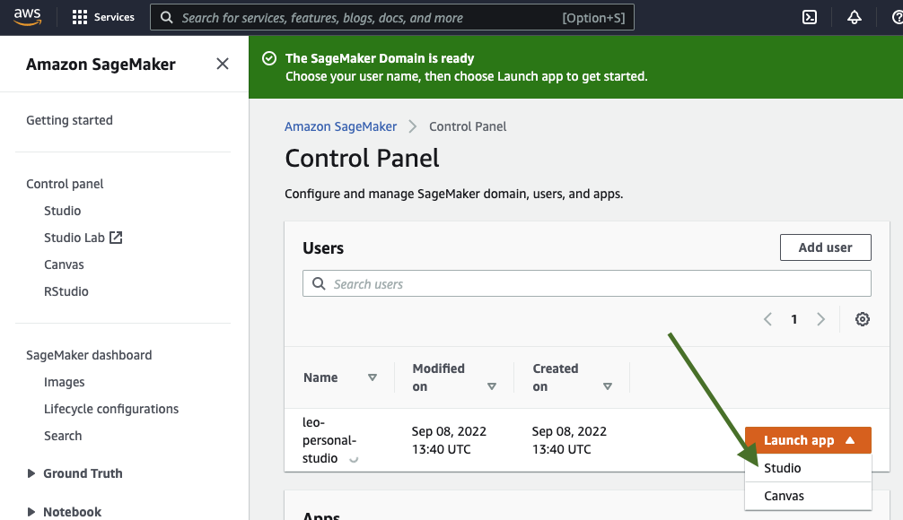

1. After some loading, your brand new jupyter lab interface running on Sagemaker studio servers will open up. If the loading gets stuck on a white screen, try refreshing the page.
    - You can clone any github repository. For example, you can clone this course repository: https://github.com/stephenleo/sagemaker-deployment.git
    - Follow the lessons in the `notebooks/` directory.

    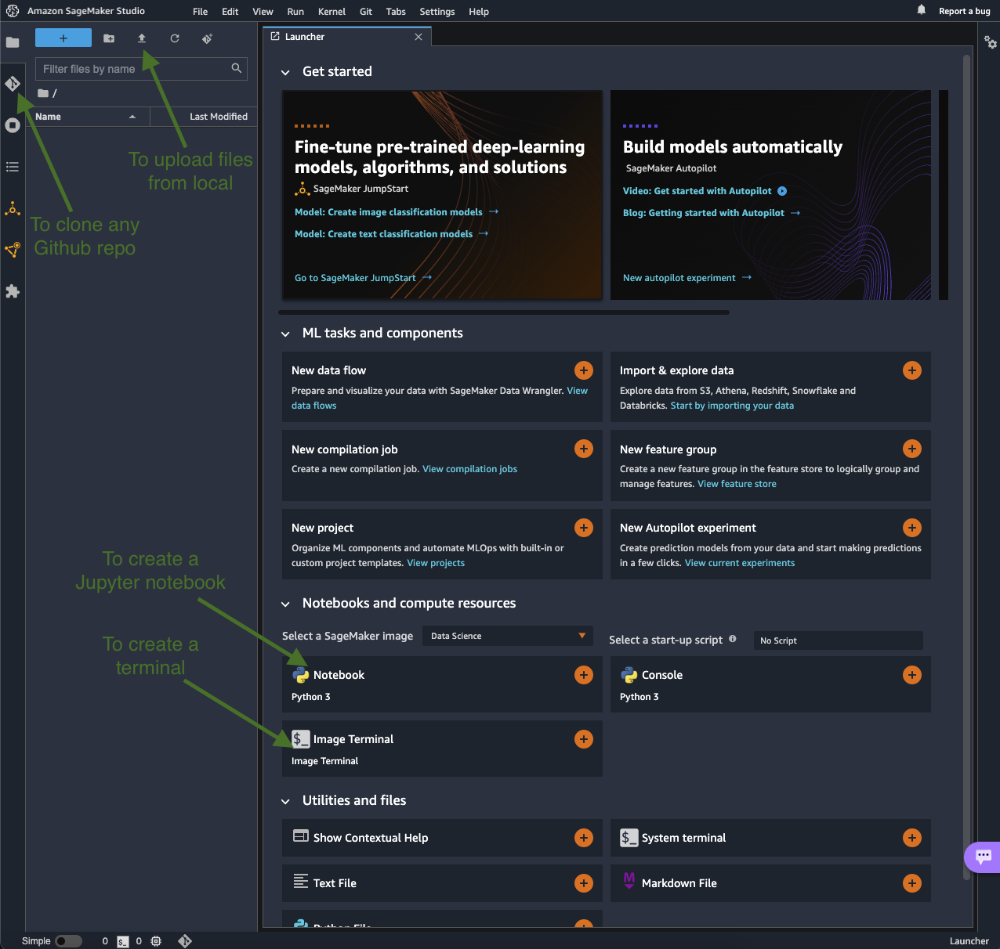
    
1. While running any code, if you get an error that the kernel is still starting, look at the bottom of your screen for the Kernel status

    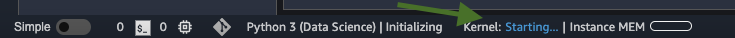
    
1. You can run the cell once the Kernel status is Idle

    

1. When you’re done with Sagemaker Studio, REMEMBER to shut down everything to prevent getting charged $!

    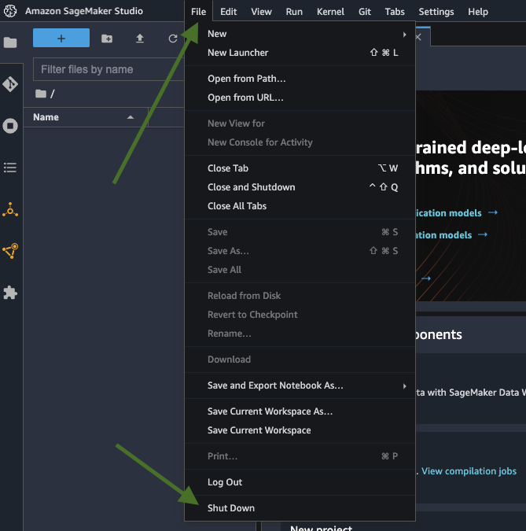

    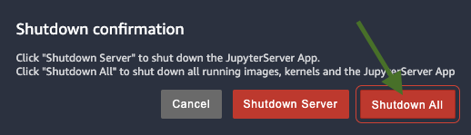

1. You will get the below message only if you opened at least one jupyter notebook on the studio instance. So if you don’t get this, just create a new notebook, let it start up and then try shutting down again just to be sure.
    
    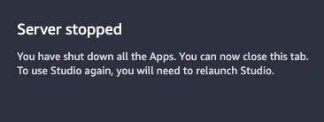
